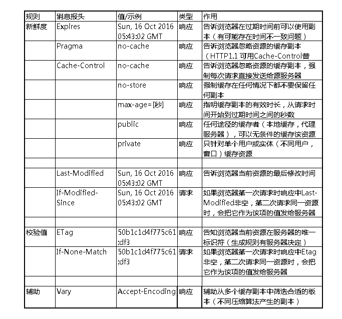

## Web缓存技术

### 一、缓存概述

缓存原本是一个硬件的概念：缓存就是数据交换的缓冲区（称作Cache），当某一硬件要读取数据时，会首先从缓存中查找需要的数据，如果找到了则直接执行，找不到的话则从内存中找。由于缓存的运行速度比内存快得多，故缓存的作用就是帮助硬件更快地运行。

在一个Web应用中，应用到缓存的地方有很多，主要有浏览器缓存，页面缓存，服务器缓存，数据库缓存等。

缓存的作用主要有：

- 加快页面打开速度
- 减少网络带宽消耗
- 降低服务器压力

### 二、浏览器缓存

浏览器端缓存规则主要在HTTP协议头和HTML的meta标签中定义。他们分别从新鲜度和校验值两个维度来规定浏览器是否可以直接使用缓存中的副本，还是需要去源服务器获取更新的版本。

**新鲜度（过期机制）**：也就是缓存副本有效期。一个缓存副本必须满足以下条件，浏览器会认为它是有效的，足够新的：

- 含有完整的过期时间控制头信息（HTTP协议报头），并且仍在有效期内；
- 浏览器已经使用过这个缓存副本，并且在一个会话中已经检查过新鲜度
- 满足以上两个情况的一种，浏览器会直接从缓存中获取副本并渲染。

满足以上两个情况的一种，浏览器会直接从缓存中获取副本并渲染。

**校验值（验证机制）**：服务器返回资源的时候有时在控制头信息带上这个资源的实体标签Etag（Entity Tag），它可以用来作为浏览器再次请求过程的校验标识。如过发现校验标识不匹配，说明资源已经被修改或过期，浏览器需求重新获取资源内容。

在HTTP请求和响应的消息报头中，常见的与缓存有关的消息报头有：

**HTTP缓存机制**：

缓存行为主要由缓存策略决定，而缓存策略由内容拥有者设置。这些策略主要通过特定的HTTP头部来清晰地表达。

当一个用户发起一个静态资源请求的时候，浏览器会通过以下几步来获取资源：

- **本地缓存阶段**：先在本地查找该资源，如果有发现该资源，而且该资源还没有过期，就使用这一个资源，完全不会发送http请求到服务器；
- **协商缓存阶段**：如果在本地缓存找到对应的资源，但是不知道该资源是否过期或者已经过期，则发一个http请求到服务器,然后服务器判断这个请求，如果请求的资源在服务器上没有改动过，则返回304，让浏览器使用本地找到的那个资源；
- **缓存失败阶段**：当服务器发现请求的资源已经修改过，或者这是一个新的请求(在本来没有找到资源)，服务器则返回该资源的数据，并且返回200， 当然这个是指找到资源的情况下，如果服务器上没有这个资源，则返回404。

**用户操作行为与缓存的关系**

浏览器中的操作对缓存的影响:

- 强制刷新 – 当按下ctrl+F5来刷新页面的时候, 浏览器将绕过各种缓存(本地缓存和协商缓存), 直接让服务器返回最新的资源;
- 普通刷新 – 当按下F5或者点击刷新按钮来刷新页面的时候,浏览器将绕过本地缓蹲来发送请求到服务器, 此时, 协商缓存是有效的
- 回车或转向 – 当在地址栏上输入回车或者按下跳转按钮的时候, 所有缓存都生效

### 三、模块缓存
### 四、页面缓存
### 五、数据库缓存
### 六、缓存的复制与分发
### 七、与缓存相关的算法
### 应用一、快速消除各类缓存
### 应用二、图片缓存的预载与分发

--------

#### 参考文档：

1. [https://my.oschina.net/thinkive/blog/685716](https://my.oschina.net/thinkive/blog/685716)
2. [http://evanhahn.com/express-dot-static-deep-dive/](http://evanhahn.com/express-dot-static-deep-dive/)
3. [http://stackoverflow.com/questions/18557251/why-does-browser-still-sends-request-for-cache-control-public-with-max-age](http://stackoverflow.com/questions/18557251/why-does-browser-still-sends-request-for-cache-control-public-with-max-age)